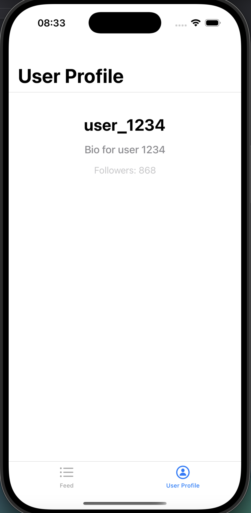

## 📌 iOS Development Assignment #2
Memory Management, Collections Performance, and Protocol Implementation

## 🚀 Features
- ✅ Memory Management – Proper use of ARC, weak, and unowned references.
- ✅ Collections Optimization – Choosing the best collection types for efficiency.
- ✅ Protocol Implementation – Implementing Hashable and Equatable for key data models.
- ✅ Avoiding Retain Cycles – Identifying and fixing memory leaks.

## 📂 Project Structure
- ProfileManager.swift – Manages user profiles with delegate and closure handling.
- UserProfileViewController.swift – Displays user profile and interacts with ProfileManager.
- ImageLoader.swift – Asynchronously loads images with delegate and completion handler.
- FeedViewController.swift – Manages a social media feed with optimized collections.
- UserProfile.swift & Post.swift – Implements Hashable and Equatable.

## 📸 Screenshots

 
   

